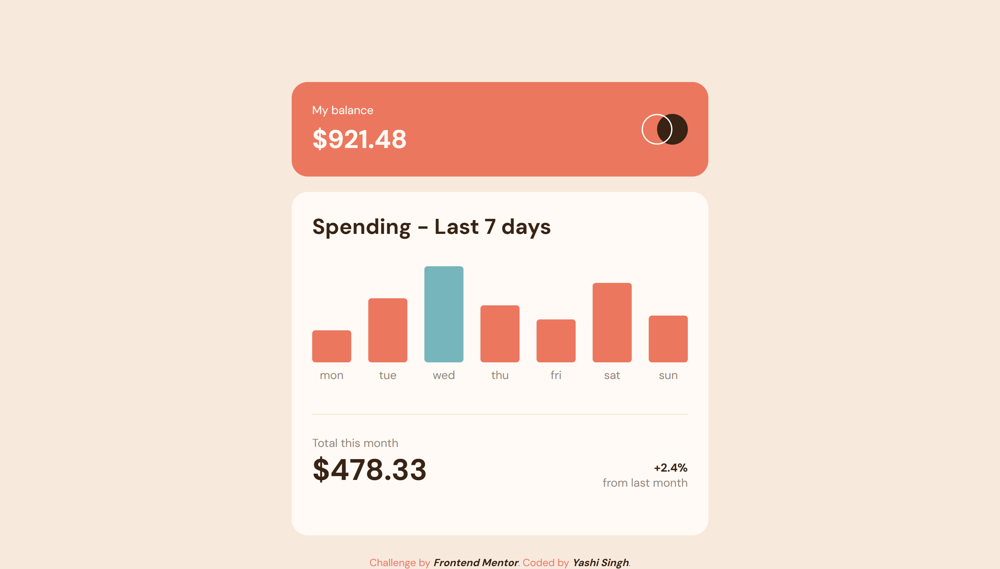
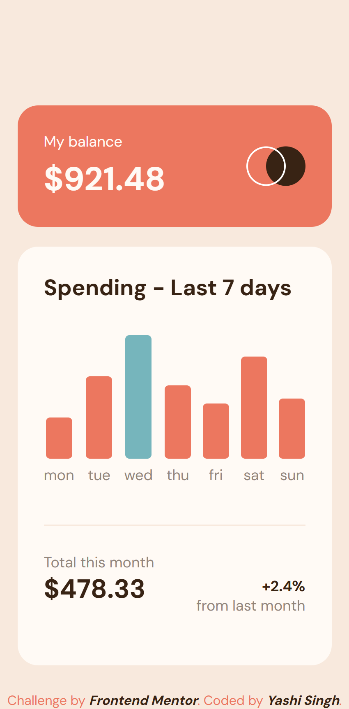

# Frontend Mentor - Expenses Chart Component Solution  

This is my solution to the [Expenses Chart Component challenge](https://www.frontendmentor.io/challenges/expenses-chart-component-e7yJBUdjwt) on Frontend Mentor. The challenge was a great opportunity to practice dynamic rendering of charts, responsive design, and working with LESS for CSS preprocessing.  

## Table of Contents  

- [Overview](#overview)  
  - [The Challenge](#the-challenge)  
  - [Screenshot](#screenshot)  
  - [Links](#links)  
- [My Process](#my-process)  
  - [Built With](#built-with)  
  - [What I Learned](#what-i-learned)  
  - [Continued Development](#continued-development)  
  - [Useful Resources](#useful-resources)  
- [Installation and Usage](#installation-and-usage)  
- [Author](#author)  
- [Acknowledgments](#acknowledgments)  

## Overview  

### The Challenge  

Users should be able to:  
- View the bar chart and hover over the individual bars to see the correct amounts for each day.  
- See the current day’s bar highlighted in a different color than the other bars.  
- View the optimal layout for the content depending on their device’s screen size.  
- See hover states for all interactive elements on the page.  
- **Bonus**: Use the JSON data file provided to dynamically size the bars on the chart.  

### Screenshot  

**Desktop Design**

  

**Mobile Design**



### Links  

- Solution URL: [Add solution URL here](https://www.frontendmentor.io/solutions/expenses-chart-component-V601e9FgJ7)  
- Live Site URL: [Live Site](https://yashi-singh-9.github.io/Expenses-Chart-Component/)  

## My Process  

### Built With  

- Semantic HTML5  
- LESS (CSS preprocessor)  
- Flexbox for layout  
- Vanilla JavaScript for dynamic functionality  
- Mobile-first workflow  

### What I Learned  

While building this project, I gained deeper insight into the following:  

1. **LESS Preprocessor**:  
   - Using variables for colors to maintain consistency across styles.  
   - Nesting CSS for better readability.  

2. **Dynamic Data Rendering**:  
   - Using `fetch()` to retrieve and render JSON data.  
   - Dynamically calculating bar heights and tooltips based on the provided data.  

3. **Responsive Design**:  
   - Adapting the chart layout for various screen sizes using media queries.  

Here's a small snippet showcasing my use of LESS variables:  
```less  
@soft-red: hsl(10, 79%, 65%);  
@cyan: hsl(186, 34%, 60%);  

.bar {  
  background-color: @soft-red;  
  &:hover {  
    opacity: 0.7;  
  }  
}  
```  

### Continued Development  

In future projects, I plan to:  
- Explore other preprocessors like SCSS for comparison.  
- Dive deeper into JavaScript frameworks like React to handle dynamic components more efficiently.  
- Refine accessibility by using ARIA attributes for charts.  

### Useful Resources  

- [LESS Documentation](https://lesscss.org/) - A great resource to understand the features and syntax of LESS.  
- [MDN Web Docs - Fetch API](https://developer.mozilla.org/en-US/docs/Web/API/Fetch_API) - Helped me understand how to fetch and process JSON data.  
- [CSS Tricks - Responsive Design](https://css-tricks.com/snippets/css/a-guide-to-flexbox/) - A comprehensive guide to mastering Flexbox for responsive layouts.  

## Installation and Usage  

Follow these steps to install and run the project:  

### Prerequisites  

1. Install Node.js (if not already installed). Download it from [Node.js](https://nodejs.org/).  
2. Install LESS globally via npm:  
   ```bash  
   npm install -g less  
   ```  

### Running the LESS Preprocessor  

1. Clone the project repository:  
   ```bash  
   git clone https://github.com/yourusername/expenses-chart-component.git  
   ```  

2. Navigate to the project directory:  
   ```bash  
   cd expenses-chart-component  
   ```  

3. Compile the LESS file to CSS:  
   ```bash  
   lessc style.less style.css  
   ```  

4. Open the `index.html` file in your browser to view the project.  

### Alternate LESS Workflow (Watch for Changes)  

To watch and automatically recompile LESS during development, run:  
```bash  
lessc style.less style.css --watch  
```  

## Author  

- LinkedIn - [Yashi Singh](https://www.linkedin.com/in/yashi-singh-b4143a246)  
- Frontend Mentor - [Yashi-Singh-9](https://www.frontendmentor.io/profile/Yashi-Singh-9)  

## Acknowledgments  

Special thanks to [Frontend Mentor](https://www.frontendmentor.io) for providing this challenge and helping me improve my skills.  
